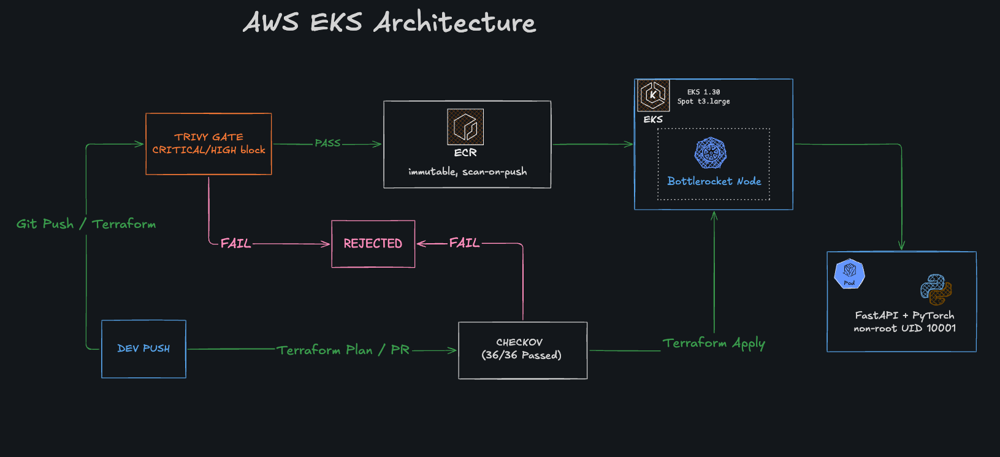
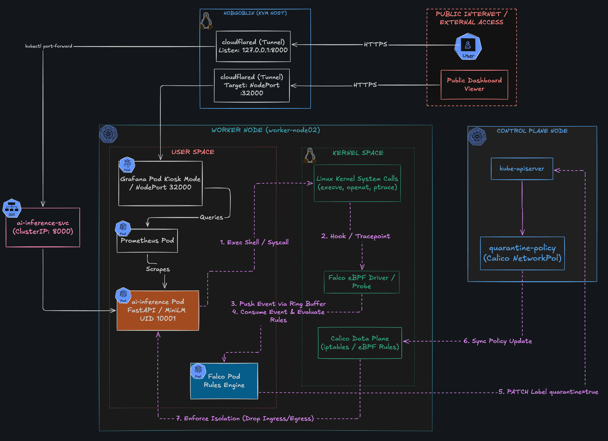

# ai-infra-poc

Hardened, ephemeral AI inference microservice on **AWS EKS** with shift-left security gates and strict cost guardrails. Full lifecycle verified: 67 resources planned → provisioned → destroyed, zero dangling resources.

## Architecture (AWS EKS)



| Layer | Detail |
|---|---|
| IaC | Modular Terraform: `vpc`, `ecr`, `eks` (with KMS CMK envelope encryption) |
| Compute | Managed node group, `SPOT`, `t3.large`, Bottlerocket (`containerd://1.7.33+bottlerocket`), 1 node (max 2) |
| Network | 2 AZs (`ap-northeast-1a/c`), **single NAT GW** |
| Registry | Private ECR, immutable tags, scan-on-push |
| Workload | Sentence-Transformers FastAPI → 384-dim embeddings; non-root, restricted `securityContext` |

## Key Engineering Decisions

- **Bottlerocket:** minimal, immutable, container-only OS. No shell/package manager, so a smaller attack surface. Node access is via SSM only (no SSH or bastion). `max-pods=35` is set through TOML.
- **Single NAT:** a NAT Gateway is the biggest fixed cost in the stack. One NAT instead of one per AZ trades AZ-level egress HA for budget. This is acceptable for an ephemeral lab.
- **IMDSv2 enforced** (`http_tokens=required`, hop limit 2): blocks SSRF-based credential theft from the metadata endpoint. Hop limit 2 keeps pod access to IMDS working.
- **KMS CMK:** envelope encryption for Kubernetes secrets, plus KMS encryption on ECR.
- **CVE triage (v1.0.0 → v1.0.1):** the Trivy gate blocked **16 CVEs (2 Critical, 14 High)**. Fixes:
  1. Upgraded dependencies (`fastapi`, `torch>=2.6`, `sentence-transformers>=3`, `pydantic`).
  2. Removed `pip`/`setuptools`/`wheel` from the runtime image.
  3. Ran `apt-get upgrade` in the runtime stage for OS-level CVEs.
  4. Documented the remaining non-exploitable findings in `.trivyignore`.
  
  Result: **0 actionable CVEs**.
- **Cost guardrails:** Spot capacity, single NAT, 1 node, short log retention, and `terraform destroy` after each run.

## Local Sandbox: eBPF Threat Detection & Runtime Quarantine



Pre-cloud validation phase on a local KVM sandbox, run before anything was provisioned on AWS. It validates runtime syscall monitoring (eBPF/Falco) and automated workload isolation (Calico quarantine) against the same inference workload.

- **Detection:** Falco rules in [`security/falco/`](security/falco/rules-ai-inference.yaml) watch syscalls from the inference pod.
- **Containment:** [`k8s/quarantine-policy.yaml`](k8s/quarantine-policy.yaml) isolates a flagged pod, and [`k8s/network-policy.yaml`](k8s/network-policy.yaml) enforces egress isolation.
- **Evidence:** [egress isolation](docs/evidence/local/03_k8s_egress_isolation.txt), [quarantine verification](docs/evidence/local/04_containment_quarantine_verification.txt), [in-cluster inference](docs/evidence/local/02_k8s_incluster_inference.json).

## Proof of Work

| PoW | Claim | Evidence |
|---|---|---|
| 01 Shift-Left SAST | Trivy blocked 16 CVEs (v1.0.0) | [01a (detail)](docs/evidence/aws-eks/01_shift_left_security/01a_trivy_gate_blocked_before.png), [01b (summary)](docs/evidence/aws-eks/01_shift_left_security/01b_trivy_summary_before.png) |
| | 0 CVEs in v1.0.1 | [01c](docs/evidence/aws-eks/01_shift_left_security/01c_trivy_gate_passed_after.png) |
| | Checkov 36/36 passed | [01d](docs/evidence/aws-eks/01_shift_left_security/01d_checkov_iac_passed.png) |
| 02 Cost & Guardrails | KMS CMK + 67 resources | [02a](docs/evidence/aws-eks/02_cost_and_iac_guardrails/02a_kms_envelope_encryption.png) |
| | Single NAT enforced | [02b](docs/evidence/aws-eks/02_cost_and_iac_guardrails/02b_single_nat_cost_guardrail.png) |
| 03 Hardened Node | Bottlerocket OS verified | [03](docs/evidence/aws-eks/03_bottlerocket_node_hardening/03_bottlerocket_node_verified.png) |
| 04 Registry Gate | 0 Criticals on ECR | [04](docs/evidence/aws-eks/04_supply_chain_registry/04_ecr_image_scan_verified.png) |
| 05 Live Workload | HTTP 200, 384-dim vector | [05](docs/evidence/aws-eks/05_live_workload_verification/05_live_inference_success.png) |

## Reproduce

```bash
cd terraform/environments/prod && terraform init && terraform plan -var='cluster_endpoint_public_access_cidrs=["<your-ip>/32"]'
checkov -d ../.. --config-file ../../.checkov.yaml --compact          # IaC gate
trivy image --severity HIGH,CRITICAL --ignorefile .trivyignore --exit-code 1 <ecr-url>:v1.0.1   # container gate
terraform apply -var='cluster_endpoint_public_access_cidrs=["<your-ip>/32"]'  # ⚠ billable
terraform destroy -var='cluster_endpoint_public_access_cidrs=["<your-ip>/32"]' # always tear down
```
